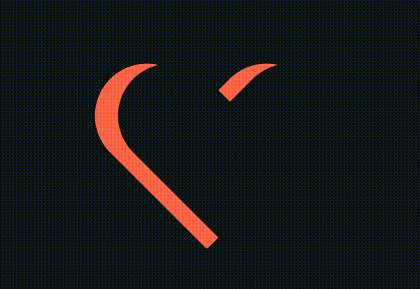

## 梦幻西游官网走灯人
### 资源图

### 效果图

### 完整代码
[代码链接](https://codepen.io/wavedanger/pen/abdOEpK?editors=1100)

---

## 冰川网络图片关门效果
### 效果图

<ul class="p1">
  <li>
    
    <h1>影武者</h1>
    
MMORPG

     

     

       <a href="">进入官网</a>
       <a href="">游戏论坛</a>
    

  </li>
  <li>
     
    <h1>远征</h1>
    
MMORPG

     

     

       <a href="">进入官网</a>
       <a href="">游戏论坛</a>
    

  </li>
</ul>

### 完整代码
[代码链接](https://codepen.io/wavedanger/pen/oNbYaRy)

---

## 心形动画
### 效果图

<!--  -->

### 完整代码
[代码链接](https://codepen.io/wavedanger/pen/MWKJQqa?editors=1100)

---

## 太极图
### 效果图

### 完整代码
[代码链接](https://codepen.io/wavedanger/pen/dyGNLxp?editors=1100)

---

## 守望先锋英雄选择
### 效果图

  <a href="https://ow.blizzard.cn/heroes/genji" class="hero">
    
    
       <svg viewBox="0 0 32 32" role="presentation" class="icon">
              <g>
                  <path d="M2.1 28.1h7.1V32H2.1z"></path>
                  <path d="M9.1 7v-.7C8.6 1.5 5.6 0 5.6 0s-3 1.5-3.5 6.3V25.4h7V7z"></path>
              </g>
              <g>
                  <path d="M12.5 28.1h7.1V32h-7.1z"></path>
                  <path d="M19.5 7v-.7C19 1.5 16 0 16 0s-3 1.5-3.5 6.3V25.4h7V7z"></path>
              </g>
              <g>
                  <path d="M22.9 28.1H30V32h-7.1z"></path>
                  <path d="M29.9 7v-.7C29.4 1.5 26.4 0 26.4 0s-3 1.5-3.5 6.3V25.4h7V7z"></path>
              </g>
        </svg>源氏
    
   </a>
    <a href="https://ow.blizzard.cn/heroes/doomfist" class="hero">
    
    
      <svg viewBox="0 0 32 32" role="presentation" class="icon">
            <g>
                <path d="M2.1 28.1h7.1V32H2.1z"></path>
                <path d="M9.1 7v-.7C8.6 1.5 5.6 0 5.6 0s-3 1.5-3.5 6.3V25.4h7V7z"></path>
            </g>
            <g>
                <path d="M12.5 28.1h7.1V32h-7.1z"></path>
                <path d="M19.5 7v-.7C19 1.5 16 0 16 0s-3 1.5-3.5 6.3V25.4h7V7z"></path>
            </g>
            <g>
                <path d="M22.9 28.1H30V32h-7.1z"></path>
                <path d="M29.9 7v-.7C29.4 1.5 26.4 0 26.4 0s-3 1.5-3.5 6.3V25.4h7V7z"></path>
            </g>
        </svg>
      末日铁拳
    
   </a>
  <a href="https://ow.blizzard.cn/heroes/soldier-76" class="hero">
    
    
      <svg viewBox="0 0 32 32" role="presentation" class="icon">
            <g>
                <path d="M2.1 28.1h7.1V32H2.1z"></path>
                <path d="M9.1 7v-.7C8.6 1.5 5.6 0 5.6 0s-3 1.5-3.5 6.3V25.4h7V7z"></path>
            </g>
            <g>
                <path d="M12.5 28.1h7.1V32h-7.1z"></path>
                <path d="M19.5 7v-.7C19 1.5 16 0 16 0s-3 1.5-3.5 6.3V25.4h7V7z"></path>
            </g>
            <g>
                <path d="M22.9 28.1H30V32h-7.1z"></path>
                <path d="M29.9 7v-.7C29.4 1.5 26.4 0 26.4 0s-3 1.5-3.5 6.3V25.4h7V7z"></path>
            </g>
        </svg>
      士兵76
    
   </a>
  <a href="https://ow.blizzard.cn/heroes/mccree" class="hero">
    
    
      <svg viewBox="0 0 32 32" role="presentation" class="icon">
            <g>
                <path d="M2.1 28.1h7.1V32H2.1z"></path>
                <path d="M9.1 7v-.7C8.6 1.5 5.6 0 5.6 0s-3 1.5-3.5 6.3V25.4h7V7z"></path>
            </g>
            <g>
                <path d="M12.5 28.1h7.1V32h-7.1z"></path>
                <path d="M19.5 7v-.7C19 1.5 16 0 16 0s-3 1.5-3.5 6.3V25.4h7V7z"></path>
            </g>
            <g>
                <path d="M22.9 28.1H30V32h-7.1z"></path>
                <path d="M29.9 7v-.7C29.4 1.5 26.4 0 26.4 0s-3 1.5-3.5 6.3V25.4h7V7z"></path>
            </g>
        </svg>
      麦克雷
    
   </a>

### 完整代码
[代码链接](https://codepen.io/wavedanger/pen/YzwNbrr?editors=1100)