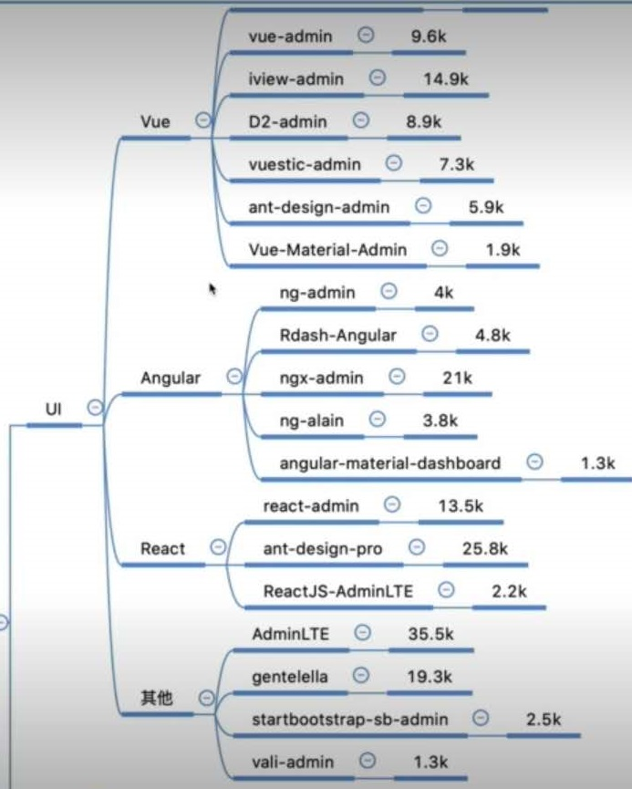
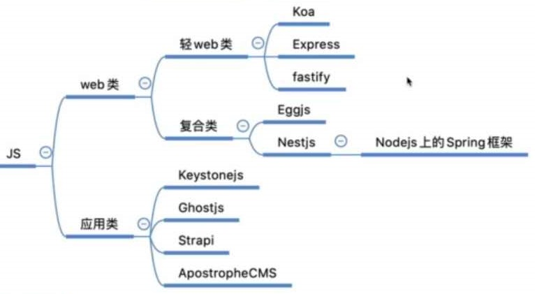

## 什么是“中台”

* 阿里先行提出，中台概念先行者SuperCell
* “中台”是企业级的逻辑概念（技术架构），为业务提供公共服务的聚合全流程平台。实现数据复用，提高服务可用性和业务的响应能力。

  

### “中台”解决了什么问题

* 易用性：数据共用，复用，多用（可以是同个数据库）
* 扩展性：重复造轮子，缩短研发周期
* 独立性：模块化服务->积木化服务->不同流程

### 企业如何落地

* 思维转变，沟通提效
* 采用云平台，专注于业务层、数据服务层
* 量力而行，水到渠成（考虑项目的共性，模式，数量，刚开始应采用现有成熟稳定方案）

### 前端人的思考

* 着眼技术变化，了解行业动态
* 综合性人才：产品->需求->开发->运维->测试
* 能够带来价值的成果

### 前端工程师需要学习后台吗？

* 必需的
* 与后台工程师对接顺利

### 前端工程师也能写后台？

* Node.js的发展

## 常见中后台开发框架

* 这里分为UI和JS，如下图
  
  

  

* 由于很多框架官网并不提供适合我们的例子，以egg.js为例，我们可以在github上搜索egg.js example(项目)，然后对照官方文档学习

## 如何开发一个中后台web框架

### 基本的组成部分

* 中间件
  * 控制器
  * 路由
  * 配置
  * 服务
* 扩展
  * 数据库
  * 日志
  * 缓存
  * WebSocket
  * 新技术应用
    * 微服务
    * GraphQL
  * CLI

### 上手简单的web框架

* 需求
  * REST ful风格
  * 热更新
  * 打包+开发编译版本
  * webpack集成
    * Sass
    * CleanWebpack
    * friendly-errors-webpack-plugin
    * babel or ts-loader
* 技术栈
  * typescript
  * koa
  * webpack

## 总结

* 讲的内容很多，真的学不动啦。。。
* 页面切图仔真的存活不了了！！！