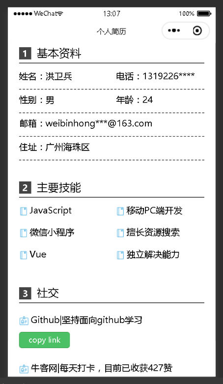
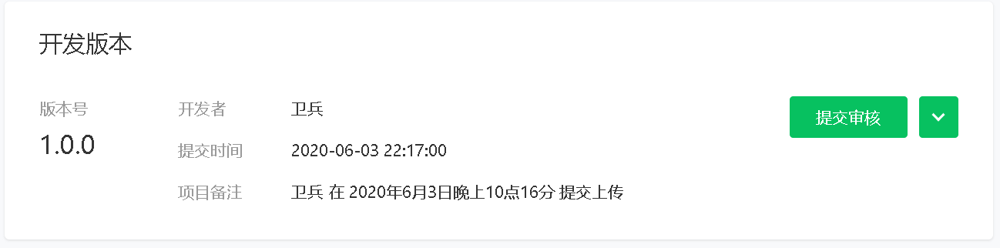
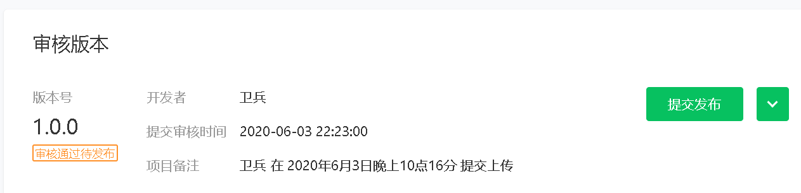
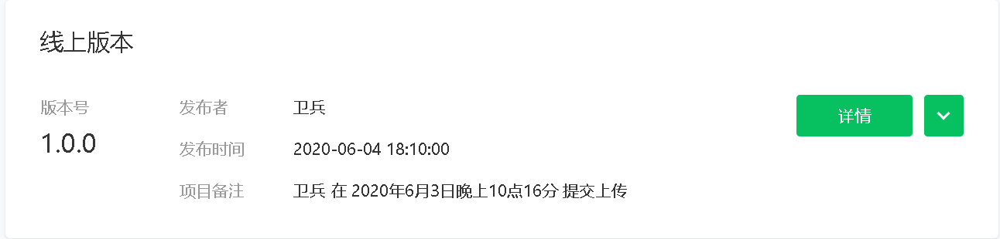

## 项目展示
<div>


</div>

## 项目链接
- [个人简历-小程序](https://github.com/wavedanger/resume-demo)
- git clone git@github.com:wavedanger/resume-demo.git
- 开发者工具引入对应项目路径即可使用

## 主要代码
1. 整体结构，整体为swiper，每一页为swiper-item，每一页中再嵌套scroll-view实现内容滚动
   ```html
   <swiper style="height:{{height}}px">
    <swiper-item>
      ...封面
    </swiper-item>
    <swiper-item>
      <scroll-view scroll-y="true" style="width:{{width}}px;height:{{height}}px">
         ...内容页
      </scroll-view>
    </swiper-item>
     <swiper-item>
      <scroll-view scroll-y="true" style="width:{{width}}px;height:{{height}}px">
         ...内容页
      </scroll-view>
    </swiper-item>
    ...
   </swiper>
   ```
2. swiper，scroll-view铺满小程序，onShow生命周期获取可使用[wx.getSystemInfoSync](https://developers.weixin.qq.com/miniprogram/dev/api/base/system/system-info/wx.getSystemInfoSync.html)拿到窗口宽高，再通过css设置到swiper,scroll-view上
   ```js
   onShow: function () {
    var width = wx.getSystemInfoSync().windowWidth;
    var height = wx.getSystemInfoSync().windowHeight;
    this.setData({
      width,
      height
    })
   }
   ```

3. 页面链接复制，众所周知，小程序无法实现跳转a标签，通过[wx.setClipboardData](https://developers.weixin.qq.com/miniprogram/dev/api/device/clipboard/wx.setClipboardData.html)和data-*来拷贝对应链接即可在浏览器打开

   ```js
    wx.setClipboardData({
      data: e.target.dataset.text,
      success (res) {
        wx.getClipboardData({
          success (res) {
            console.log(res.data) // data
          }
        })
      }
    })
   ```
## 审核发布
* 这里我居然一天就发布上线了，我自己也没想到，当然可能只是信息展示的几个页面，所以快吧，或者说不以营利为目的哈哈

   <div>
   <br/>
   <br/>
   
   </div>

* 值得注意的是，在小程序管理后台-设置-基本设置-服务类目里选择工具>办公