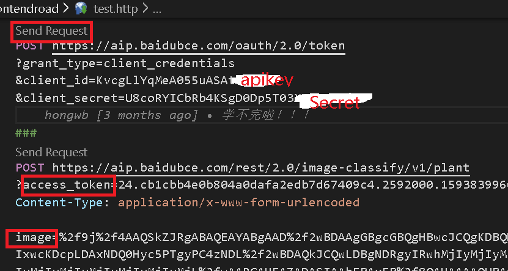
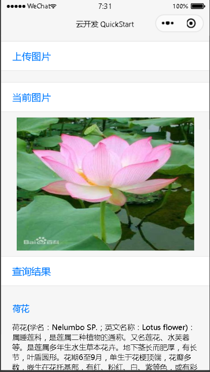
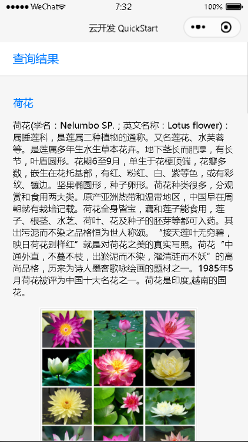
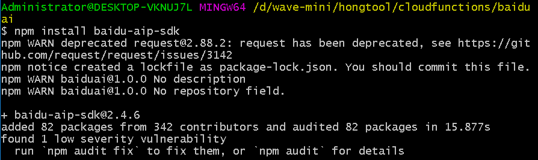

## 百度AI
* 全栈的AI能力，提供端到端软硬一体的应用，提供很多免费的接口，对于个人开发者学习完全够用
* 而要使用就必需注册百度账号及创建识别应用，[百度图像识别接口文档](https://ai.baidu.com/ai-doc/IMAGERECOGNITION/8k3e7f69o)里的QuickStart写得很清楚了，注意 API KEY 以及 Secret KEY是后续调用接口的关键
## REST Client测试接口
* 接下来我们来对接口进行测试，你也可以使用官方文档推荐的测试方法[链接:植物识别接口文档](https://ai.baidu.com/ai-doc/IMAGERECOGNITION/Mk3bcxe9i)
* 我们这里以vscode的REST Client插件为例，也是我比较推荐的，[插件链接](https://marketplace.visualstudio.com/items?itemName=humao.rest-client)，当然可以直接在vscode里直接搜索安装
* 安装完后我们新建一个以http为后缀的文件，然后用rest-client语法进行接口请求；这里百度ai需先用以上申请的API key和Secret获取access_token，再用access_token和图片地址调用植物识别接口返回信息，具体接口参照[链接:植物识别接口文档](https://ai.baidu.com/ai-doc/IMAGERECOGNITION/Mk3bcxe9i)，如下图



* 点击Send Request即可发送请求，注意下image的格式，图片需要base64编码、去掉编码头（data:image/png;base64,）后再进行urlencode。下面提供两个链接转换
  - [base64图片转换](https://tool.chinaz.com/tools/imgtobase)
  - [urlencode](https://tool.chinaz.com/Tools/urlencode.aspx)
## 小程序云开发使用
### 0. 前言
在云开发环境下，通过小程序端上传图片到云存储，云函数拿到云存储的图片后调用百度植物识别接口返回信息，小程序端再调用云函数返回的识别结果
<div>


</div>

### 1. 新建云开发项目
* 自行注册[微信公众平台](https://mp.weixin.qq.com/)小程序帐号
* 需配合小程序开发工具并开通[云开发](https://developers.weixin.qq.com/miniprogram/dev/wxcloud/basis/getting-started.html)
* 初始完云开发项目后，在云函数文件夹右键创建baiduai云函数
### 2. 安装图像识别 Node SDK([官方文档](https://ai.baidu.com/ai-doc/IMAGERECOGNITION/bk3bcxkdg#%E5%AE%89%E8%A3%85%E5%9B%BE%E5%83%8F%E8%AF%86%E5%88%AB-node-sdk))
* 在云开发环境中，打开命令行，cd到baiduai云函数，安装依赖，区别于以上测试接口时的API，依赖可以让我们更方便地调用接口
  ```
  npm install baidu-aip-sdk
  ```
  
### 3. 在baiduai云函数中新建AipImageClassifyClient([官方文档](https://ai.baidu.com/ai-doc/IMAGERECOGNITION/bk3bcxkdg#%E6%96%B0%E5%BB%BAaipimageclassifyclient))
  ```js
  var AipImageClassifyClient = require("baidu-aip-sdk").imageClassify;

  // 设置APPID/AK/SK，在以上步骤可以拿到这三个数据
  var APP_ID = "你的 App ID";
  var API_KEY = "你的 Api Key";
  var SECRET_KEY = "你的 Secret Key";

  // 新建一个对象，建议只保存一个对象调用服务接口
  var client = new AipImageClassifyClient(APP_ID, API_KEY, SECRET_KEY);
  ```
### 4. 上传本地图片到云存储
  ```javascript
    doUpload: function () {
    let that=this
    // 选择图片
    wx.chooseImage({
      count: 1,
      sizeType: ['compressed'],
      sourceType: ['album', 'camera'],
      success: function (res) {
        wx.showLoading({
          title: '上传中',
        })
        const filePath = res.tempFilePaths[0]
        // 上传图片
        const cloudPath = `flower/${Date.now()} ${filePath.match(/\.[^.]+?$/)[0]}`
        wx.cloud.uploadFile({
          cloudPath,
          filePath,
          success: res => {
            console.log('[上传文件] 成功：', res)
          },
          fail: e => {
            console.error('[上传文件] 失败：', e)
            wx.showToast({
              icon: 'none',
              title: '上传失败',
            })
          },
          complete: () => {
            wx.hideLoading()
          }
        })

      },
      fail: e => {
        console.error(e)
      }
    })
  },
  ```
### 5. 完善baiduai云函数
* 接收云存储fileID，调用植物识别接口返回对应识别信息
  ```js
    // 云函数入口函数
  exports.main = async (event, context) => {
  const {fileID}=event;
  const res=await cloud.downloadFile({
    fileID:fileID
  })
  const buffer=res.fileContent
  let image=buffer.toString("base64")
  const info=await client.plantDetect(image,{"baike_num":"5"})
  return {
    info
  }
  ```
### 6. 调用baiduai云函数
* 本地调用baiduai云函数，传入fileID，从云函数拿到识别信息，保存为data后展示
  ```js
  wx.cloud.callFunction({
    name:"baiduai",
    data:{
          fileID:res.fileID
         },
         success:res=>{
          let result=res.result.info.result;
          that.setData ({
            result,
            filePath
          })
         }
       })
  ```
  ### 7. Demo地址
  [植物识别-小程序云开发](https://github.com/wavedanger/baiduai-demo)