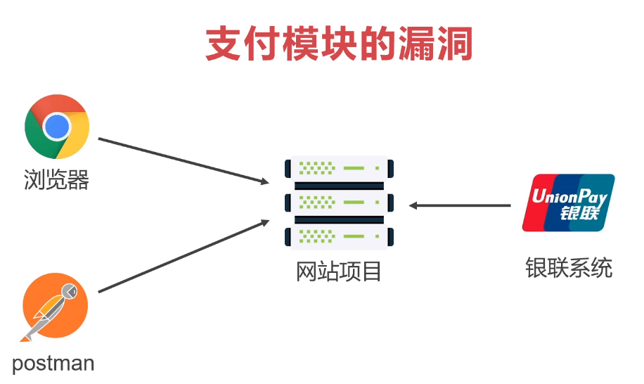
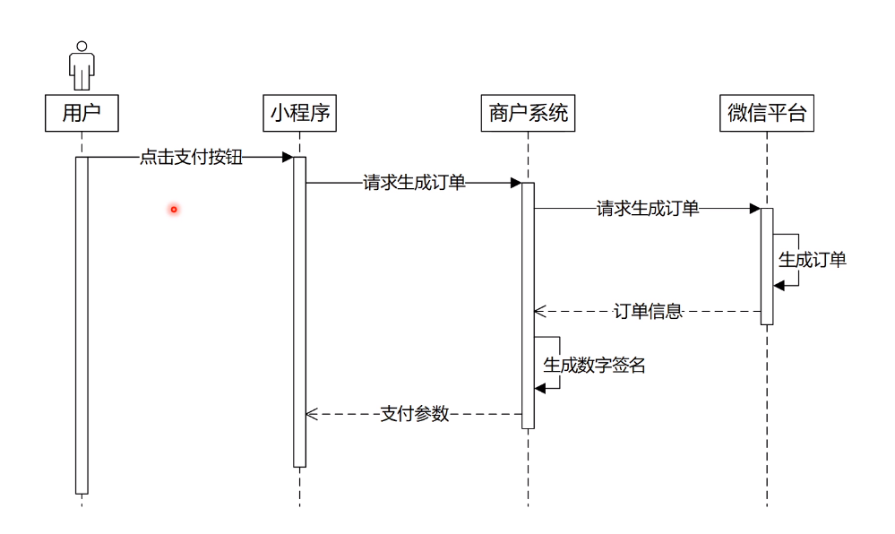
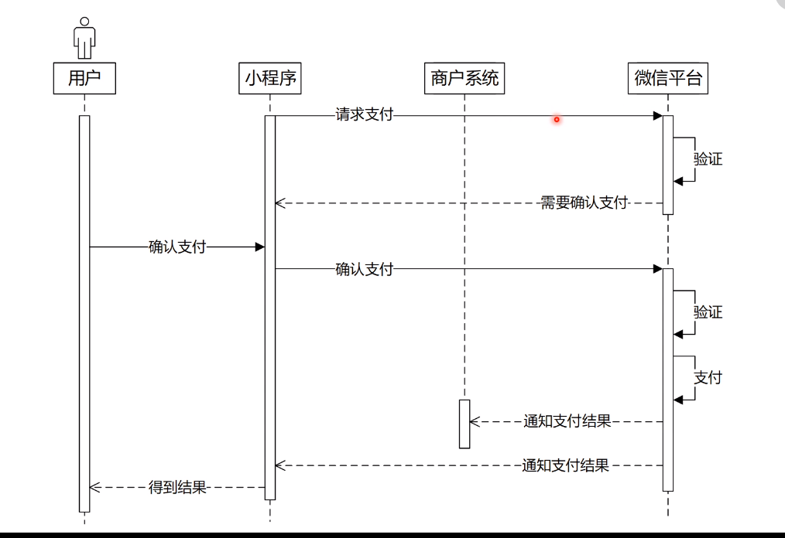

## 介绍

  站在支付新风口下，支付新模式必然出现，尤其是新零售时代，支付模式变革大势所趋，出现了线上和线下完全不同的支付模式。做商业项目必然要具备支付模块，而且随着新零售的普及，支付的方式也越来越多样。以下为神思者老师关于支付的详细文档，基于今晚所听及文档我自行梳理下。

  [新零售支付全家桶](https://www.showdoc.cc/817563107857167?page_id=4479841858638353)

---

## 支付模块的漏洞

  

* 提防伪造支付状态请求
  - 当没有数字签名时，我们可利用postman向服务器发送虚假信息，返回支付成功的状态。而服务器并不知道来源虚假，就有可能将未支付变为已支付
* 数字签名
  - 相当于网站的"身份证"，让我们识别是否第三方支付平台的请求
  - 关于相关知识点可参考[彻底搞懂HTTPS的加密机制](https://zhuanlan.zhihu.com/p/43789231)

## 支付应用

* 可以用在各种商业项目中
* 电商网站、视频网站、直播平台、线下零售、在线教育
* 涉及折扣、优惠券、团购、退款、融合支付等，并不简单

## 个人开发者使用支付

* 目前主流支付为微信、支付宝、银联
* 微信不支持，必需为企业类型；支付宝、银联提供沙箱环境
* 使用微信支付的企业需认证，提供组织机构，注册金等

## 支付流程逻辑

* 这里简单的以微信支付为例子说明下
  1. 创建支付订单
   
       

     * 小程序端发起支付请求
     * 商户系统接收请求开始处理
     * 判断用户是否存在
     * 判断订单是否存在
     * 判断代金券是否有效
     * 判断团购是否过期
     * 各种业务逻辑。。。
     * 根据订单ID拿到订单详情
     * 创建支付对象
     * 向微信平台发送生成支付订单的请求
     * 微信平台会根据订单信息核实后创建支付订单并返回
     * 商户系统得到订单后生成数字签名，并返回支付参数到小程序端
  2. 用户付款
   
       
      
     * 小程序端拿到支付参数，调用微信平台接口
     * 成功则会拉起支付窗口
     * 用户确认支付
     * 微信平台会把支付结果返给商户系统和小程序端

* 以上支付流程其实是被动发生的，也可以说是在正常条件下触发的。徜若某方面故障，像网络问题，技术故障等原因导致无法收到支付结果，所以主动查询是必要的保障。举个例子，小程序返回a订单支付成功消息后，通知商户系统，商户系统再通过a订单的订单ID向微信平台确认是否已经成功支付来修改订单状态

* 其它支付及关键点可参考[神思者老师的文档](https://www.showdoc.cc/817563107857167?page_id=4479841858638353)

## 总结

* 支付真的是门大学问，毕竟涉及到money
* 此次公开课加深了我对通用支付的理解
* 一句话，以安全支付为本！
