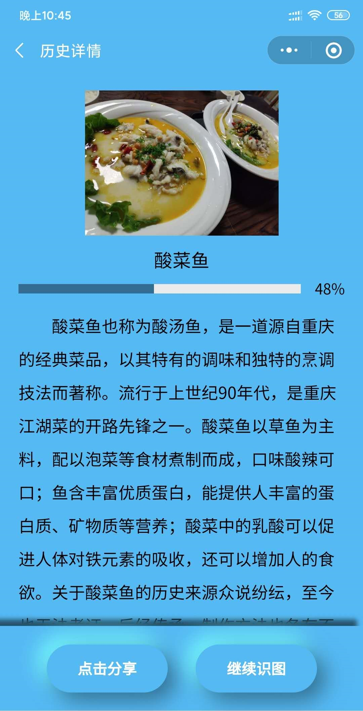
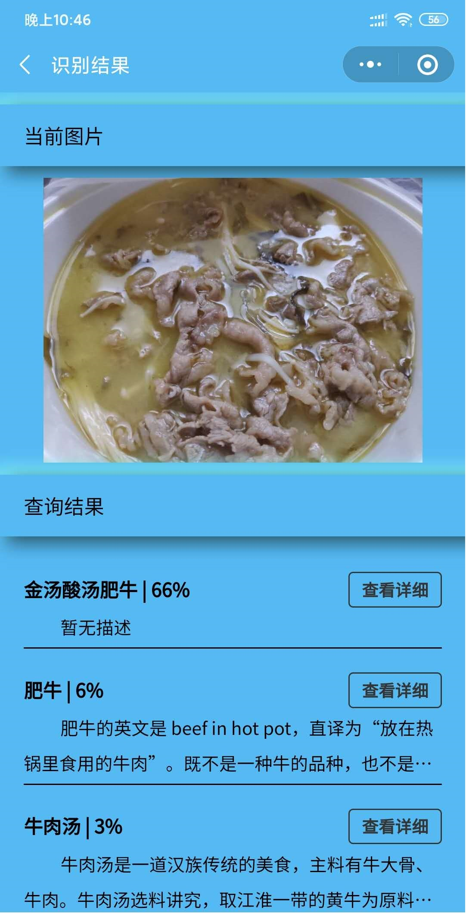

## 2020五月
### 0530
今天是正式上手VuePress的一天，了解文档结构还是有够头疼的！

## 2020六月
### 0601
六一快乐，希望你永远保有--[纯真](https://music.163.com/#/song?id=386715)！
### 0602
看了会imooc公开课，感觉自己傻傻的。
### 0603
老爷保佑，希望小程序成功审核！推荐首歌吧--[胡说八道](https://music.163.com/#/song?id=531628088)
### 0604
个人简历小程序成功上线了，没想到审核只需一天，出于个人隐私小程序码我还是不发了哈，Demo具体请看[这篇文章](https://wavedanger.github.io/pages/folder1/%E5%B0%8F%E7%A8%8B%E5%BA%8F%E7%AE%80%E5%8E%86.html#%E9%A1%B9%E7%9B%AE%E5%B1%95%E7%A4%BA)

<!--  -->

等后续有时间写下该小程序的上线历程吧，百度AI平台-植物识别也有头绪了，继续深究

好几篇想写的总结，时间不够啊，最后还是分享一首歌吧--[面对](https://music.163.com/#/song?id=1377331039)

### 0605
今天撸了两篇markdown-植物识图和个人简历小程序，感觉排版这方面还得练练。

上线了拍图识花体验版，很高兴老爹能喜欢。

vuepress看来得加些功能不然有些单一。

照旧，音乐分享--[孤独演说家](https://music.163.com/#/song?id=534970579)

### 0606
升级拍图识花1.0.2版本，让老爸提需求哈，希望能逐步完善哈

老友阿鑫约会又失败，期待下次相聚

最后分享一下很有感触的MV，来自五月天的--[转眼](https://www.bilibili.com/video/BV1Et411B7oD?from=search&seid=12676175749293740785)

### 0607
[codepen](https://codepen.io/)真是前端福利网站，我好像发现了css的乐趣了！

好久没打游戏了，今天奖励下自己！

推荐一部老电影吧，其实我真的很想出生在那个年代，那时天总是很蓝，日子总过得很慢--[多彩的晨光](https://www.bilibili.com/video/BV1As411b7qM?from=search&seid=4624439209951007326)

### 0608
思考
### 0609
思考
### 0610
思考人生第三天

隔一段时间还是得听一下--[如烟](https://www.bilibili.com/video/BV1aJ411779m?from=search&seid=1347290849879088340)

::: tip 如烟
有没有那么一个明天 重头活一遍

让我再次感受曾 挥霍的昨天

无论生存或生活 我都不浪费

不让故事这么的后悔

有谁能听见

我不要告别
:::
### 0611
今天主要还是捣鼓了vuepress-theme-reco主题，还挺好看的

本日音乐--[逝年](https://music.163.com/#/song?id=32957955)

::: tip 逝年
时间似流水

催促我们长大

年轻的心有了白发

当初的人呐

你们如今在哪

是否也在寻找梦的家
:::
### 0612
vuepress-theme-reco主题加了评论

今天整部电影--[摩天营救](https://www.bilibili.com/bangumi/play/ss33762/)
### 0613
今天出了趟门，相约三位老友，好久不见，阿坤英语进步很多，我要向他学习；米九嘉壮了不少，能扛一箱安慕希上山不带喘；阿鑫终于出门了，可他不知道que德地图并不想让他好过。今天早些睡了，晚安！

本日音乐--[玫瑰往事](https://music.163.com/#/song?id=1340627237)

### 0616
无

### 0617
2028年的我会在哪里呢？

本日音乐--[恋曲2018](https://music.163.com/#/song?id=1336871780)

### 0619
本日音乐--[时光机](https://music.163.com/#/song?id=386469)
::: danger 时光机
全剧终 看见满场空座椅

灯亮起 这故事

好像真实又像虚幻的情境

只是那 好不容易被说服的自己

借口又顶不住懊恼的侵袭
:::

### 0621
今天是父亲节，完善了拍图识物小程序，算是给老爹一个礼物吧，不知道他喜不喜欢。

有一说一，UI方面没有设计图，真的很low啊。


本日音乐--[莲花池公园](https://music.163.com/#/song?id=485372294)
::: tip 莲花池公园
翻开照片 看见回忆一点一点出现在眼前

小时候我最喜欢去莲花池公园

对妈妈做鬼脸 坐在爸爸的肩

他们为我永不会疲倦
:::

### 0622
今天还是整了识图小程序，加了历史记录，分享，重构了代码，用了缓存，函数化，整了拟态UI。。。

提交审核看看能不能上线，祝好运




本日音乐--[勺子](https://music.163.com/#/song?id=489997111)

::: tip 勺子
什么样的坚持可以成为坚持

不会被流言打扰后渐渐迷失

什么样的陪伴不会戛然而止

像剧本设计的那般完美无疵

什么样的故事可以成为故事

不会被岁月洗礼到不为人知
:::

### 0624
不得不承认自己做菜水平还有待提高哈

本日音乐--[色盲](https://music.163.com/#/song?id=405253742)

::: tip 色盲
蓝色的唇印 绿色的嘴角

白色的耳廓 银色的发梢

暗黄的瞳孔 鲜红的眼角

看见的你啊 全部都混淆

惨白的手心 黯淡的微笑

闪烁的指尖 透明的拥抱

就算没揭穿 其实我明了
:::

### 0626
端午的老娘粽好吃，我一口气吃了五个！

### 0627
感谢老锋，鑫，坤的探望

侃天侃地，回忆青春美好

本日音乐--[白云无尽时](https://music.163.com/#/song?id=1391653372)

::: warning 白云无尽时
但去莫复问 白云无尽时

有些故事也许没继续 但不代表忘记

人生来又去 后会总无期

来路还有许多风景 愿能听你再说起
::: 

### 0628
感觉最近头很重，我是不是胖了

本日音乐--[这一路走来](https://music.163.com/#/song?id=26075553)

::: tip 这一路走来
这一路走来 还忍得住孤独

一个人聊胜于无

在滚滚浊世 绝不把梦交出

尽管过程多残酷
:::

## 2020七月
### 0704
本日音乐--[像](https://music.163.com/#/song?id=1445060640)

::: danger 像
这月亮像寂寞 在身边却不可及

城市的灯火啊 在距你最近的地方

像什么呢想什么呢 万物生长安静来临

像什么呢想什么呢 我不要坠入深渊里
:::

### 0706
又到一年高考时，明天又是书写命运的一天！

本日音乐--[我们在夏枝繁茂时再见](https://music.163.com/#/song?id=1371353582)

::: tip 我们在夏枝繁茂时再见
很久很久很久之后 我们变成陌生模样

熟悉的车站前 一如最初青涩稚嫩脸庞

曲调响起琴声悠扬 盛夏如约茂密生长

那时清风依然飞扬 天空依然晴朗

我们仍旧热泪盈眶
:::

### 0707
该不该考公呢？

今天看到这片文章--[「面试」45 道牛客网 JavaScript 经典题总结（8500字）](https://mp.weixin.qq.com/s/Q7fA1ppO16P4G96YiVUShw)，不知不觉已经在牛客学习快一年了哈

本日音乐--[η](https://music.163.com/#/song?id=29137871)

### 0709
跑跑停停，今晚算是跑了40分钟吧


本日音乐--[夏之风](https://music.163.com/#/song?id=479494742)

### 0714

本日音乐--[愿望](https://music.163.com/#/song?id=4875870875)

::: danger 愿望
安静太多太多就没有惶恐

想得太久太久也无动于衷

人们太多太多都这么错过
:::

### 0719

字不重要，看图


本日音乐--[岛屿](https://music.163.com/#/song?id=1418131335)

::: danger 岛屿
有一个岛屿 在北极冰川

那儿没有花朵 也没有失落

在那个岛屿 洒满了繁星

拥有我和你 再没有失落
:::

### 0720

本日音乐--[麻雀](https://music.163.com/#/song?id=1407551413)

::: warning 麻雀
也许我笨蛋 飞太慢会落单

太快会受伤 日子不就都这样
:::

### 0721

本日音乐--[逆风（春暖花开）](https://music.163.com/#/song?id=470025544)

::: tip 逆风（春暖花开）
没有那么绝望 还有一点希望

连一只风筝 都可以在逆风里起航
:::

### 0722

久违的骑行！


<video src="./class1/bike.mp4" width="300px" controls></video>

::: tip
之前一直想用网易云音乐的生成外链播放器的，但一直提示没有版权，今天意外发现之前的iframe代码还是能用如下，只要替换歌曲id即可！但是遗憾的是没有版权依旧不能播放，不知还有没有其它解决办法！
:::

```html
<iframe
  frameborder="no"
  border="0"
  marginwidth="0"
  marginheight="0"
  width="330"
  height="86"
  src="//music.163.com/outchain/player?type=2&id=386717&auto=0&height=66"
></iframe>

<iframe
  frameborder="no"
  border="0"
  marginwidth="0"
  marginheight="0"
  width="298"
  height="52"
  src="//music.163.com/outchain/player?type=2&id=386717&auto=0&height=32"
></iframe>
```

<iframe
  frameborder="no"
  border="0"
  marginwidth="0"
  marginheight="0"
  width="330"
  height="86"
  src="//music.163.com/outchain/player?type=2&id=386717&auto=0&height=66"
></iframe>

### 0730

今天发现线上博客突然访问不了？但为什么朋友可以访问！

::: tip 原因
pages.github.com 拒绝了我们的连接请求。
:::

### 0731

博客又复活啦！

::: tip 解决
pages.github.com国内访问不了，之前朋友能访问是因为他挂了VPN

现在我将博客放在了码云上，只要在码云直接导入github仓库再在生成gitee pages就行！

唯一遗憾的是要手动更新码云上的项目，虽说只是一个按钮即可，这算是暂时的解决方案吧！
:::

本日音乐--[云野](https://music.163.com/#/song?id=1379458324)

::: tip 云野
请在春天回来好吗 我的山坡开满了花 我会亲手为你摘下 请你带回你风中的家

请在夏天回来好吗 我的旷野下起了雨 我会独自站在雨里 亲吻你伤心的泪滴

请在秋天回来好吗 我的梦中飘落了叶 像晚霞染红你的天 也洒满每个想你的夜

请在冬天回来好吗 我的天空下起了雪 大雪落在我孤独的旷野 像你每次无言的告别
:::

## 2020八月
### 0811

github pages真的挂了，连我整的github图床都扑街了，看来得转战gitee了

本日音乐--[漠河舞厅](https://music.163.com/#/song?id=1430319727)
 
::: tip 漠河舞厅
如果有一天 我的信念忽然倒塌

城市的花园没有花 广播里的声音嘶哑

如果真有这天的话 你会不会奔向我啊

尘封入海吧
:::

### 0819

网易云外链好像复活了！

<iframe frameborder="no" border="0" marginwidth="0" marginheight="0" width=330 height=86 src="//music.163.com/outchain/player?type=2&id=1444781693&auto=0&height=66"></iframe>